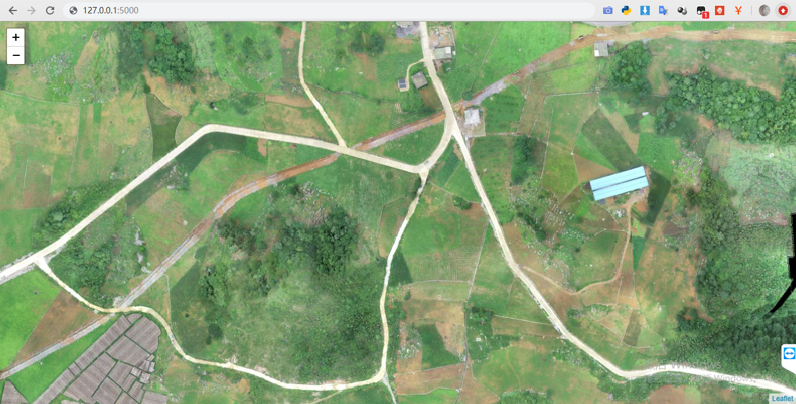

# BigImageViewer
Big image viewer supporting pan and zoom, using python flask and leaflet.js

超大图像浏览，支持缩放和平移。



### 用途 Where to use

- 医疗影像
- 卫星遥感影像
- 超大全景图

### 支持格式 Image format

- png
- jpg
- tif

### 用法 How to run

​	1、生成瓦片 generate image tiles

```bash
python tiles_generator/deepzoom.py <raw_big_image_path> -s 256 -d <tiles_save_path> -f jpg
```

***NOTES: python 2.7 with pillow(PIL) installed***

​	2、修改配置 modify web configurations

- 修改`index.html`中的`'../static/DeepZoomImage/u1_files/'`、`width`和`height`

  ```javascript
          var map = L.map('image2d').setView(new L.LatLng(0,0), 0);
  
          var dzLayer = L.tileLayer.deepzoom('../static/DeepZoomImage/u1_files/', {
              width: 42614,
              height: 20767
          }).addTo(map);
  ```

- 修改`static/DeepzoomImage/hubble.xml`中的`width`和`height`

```xml
<?xml version="1.0" encoding="utf-8"?><Image TileSize="256" Overlap="1" Format="jpg" ServerFormat="Default" xmlns="http://schemas.microsoft.com/deepzoom/2009"><Size Width="42614" Height="20767" /></Image>
```

​	3、运行`python web/server.py`

### 参考 References

- [http://openseadragon.github.io/examples/creating-zooming-images/](http://openseadragon.github.io/examples/creating-zooming-images/)

- [https://projectmirador.org/demo/](https://projectmirador.org/demo/)

